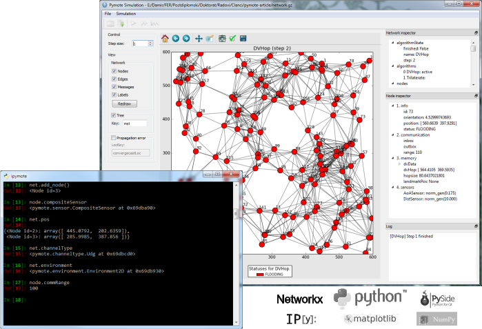

Starting PyDistSim
===============
PyDistSim features interactive console based on IPython and simulation GUI.

   PyDistSim console and GUI

Interactive console (IPython)
-----------------------------
To use PyDistSim from the interactive console (IPython) start provided program
``ipydistsim`` with previously activated virtual environment::

    > ipydistsim

.. note::

    If virtualenv is used make sure that virtual environment is activated (:ref:`linux <linux-venvact>`, :ref:`windows <windows-venvact>`) and if WinPython is used then run ``ipydistsim`` from WinPython Command Prompt.

PyDistSim can also be started by starting IPython directly and using dedicated ``pydistsim`` profile::

    > ipython --profile=pydistsim

.. note::

    PyDistSim profile files should be present inside
    ``pydistsim_env/.ipython/profile_pydistsim/ipython_config.py``
    or ``~/.ipython/profile_pydistsim/ipython_config.py`` file created during PyDistSim installation.

Simulation GUI
--------------
PyDistSim features simulation GUI which can be started as standalone application using
``pydistsim-simgui`` (in Windows ``pydistsim-simgui.exe``).

.. note::

    If pydistsim is installed in virtual environment then `pydistsim-simgui` starts inside this
    environment. When network pickle is opened in simulator all algorithms this network is
    referencing must be importable from virtual environment.

Simulation GUI running from the interactive console
^^^^^^^^^^^^^^^^^^^^^^^^^^^^^^^^^^^^^^^^^^^^^^^^^^^
Very convenient way of starting and working with the GUI is from the interactive console by running ``simulationgui.py`` like this::

    In [1]: %run path/to/pydistsim/gui/simulationgui.py

The gui event loop is separated from the console. Simulation window can be accessed by using ``simgui`` and network in the simulator window by using ``simgui.net`` so all simulation objects (network, nodes, messages...) are fully inspectable and usable via console.
